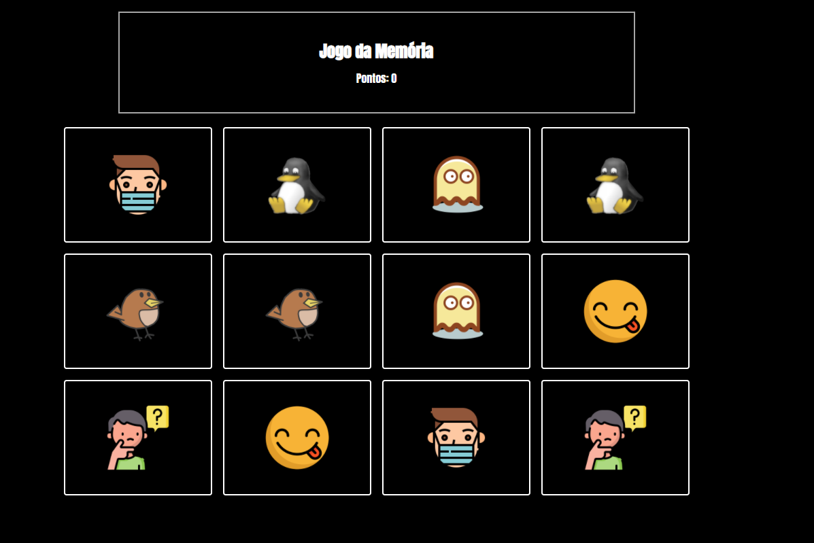
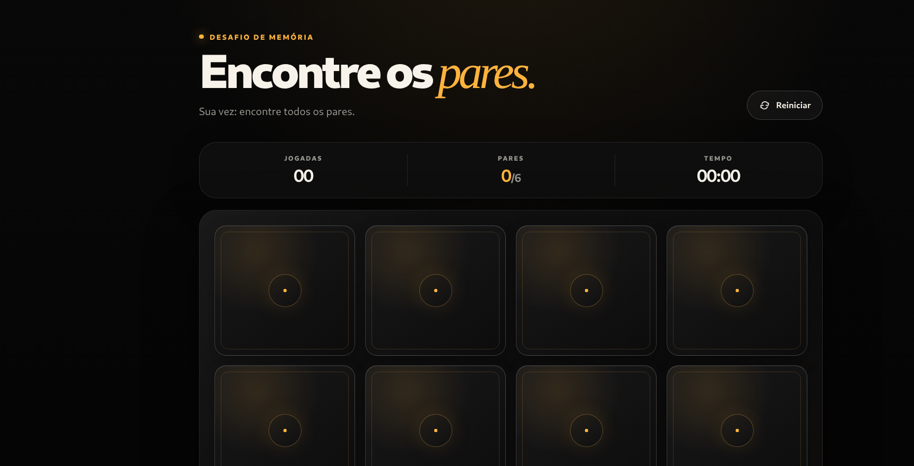

# Memory Game

A complete visual and technical evolution of the original 2022 Memory Game. The current version keeps the project's black identity and all 12 original card images while delivering smoother gameplay, stronger feedback, better accessibility and a layout designed for phones, tablets and desktops.

Built with semantic HTML, modern CSS and vanilla JavaScript. No frameworks, build tools, external fonts or runtime dependencies are required.

## Visual evolution

### Original version — 2022



The original release established the core idea: a simple black interface, 12 illustrated cards, six matching pairs and a points counter. It was a functional first version with a compact codebase and straightforward gameplay.

### Current version — 2026



The current release preserves the original illustrations and dark identity, but rebuilds the presentation and interaction system. It introduces a modern game header, a complete status panel, true 3D card flips, clearer match feedback, a completion screen and reliable responsive behavior.

## 2022 vs current version

| Area | 2022 version | Current version |
| --- | --- | --- |
| Visual design | Basic black layout with simple borders | Layered dark interface with warm orange accents, depth and stronger hierarchy |
| Card interaction | Basic front reveal | Smooth 3D flip animation with hover, focus and match feedback |
| Responsive layout | Limited three/four-column breakpoint | Fluid three/four-column grid tested from 280 px to large desktop screens |
| Game information | Points counter only | Moves, matched pairs, timer and live status messages |
| Shuffle logic | Random CSS order that could repeat positions | Fisher–Yates algorithm for a valid and uniform shuffle |
| Round flow | Initial card reveal and basic matching | Guided preview, input locking, restart control and completion dialog |
| Accessibility | Clickable `div` elements and empty image descriptions | Semantic buttons, descriptive alternative text, keyboard focus and ARIA feedback |
| Motion preferences | No reduced-motion handling | Respects the operating system's reduced-motion preference |
| Dependencies | External Google Fonts request | System fonts only, with no external runtime requests |
| Performance | Repeating intervals used for one-time actions | Bounded timeouts, one game timer and no continuous visual loop |

## Main features

- Six pairs using the 12 original images
- Smooth 3D card-flip animation
- Responsive layout for mobile, tablet and desktop
- Moves, matched-pairs and elapsed-time counters
- Short card preview before each round
- Visual feedback for correct and incorrect attempts
- Completion dialog with the final result
- Restart button available at any time
- Mouse, touch and keyboard support
- Reduced-motion accessibility support
- Lightweight static project compatible with GitHub Pages

## How to play

1. Memorize the cards during the short opening preview.
2. Select two cards to reveal them.
3. Matching cards remain visible; different cards turn back over.
4. Find all six pairs to complete the round.
5. Use **Restart** at any time to reshuffle the board and begin again.

## Project structure

```text
Memory-Game/
├── index.html
├── script.js
├── style.css
├── README.md
├── memory-game-2022.png
├── memory-game-current.png
├── 1.png
├── 2.png
├── ...
└── 12.png
```

All files are intentionally stored in the repository root so the project can be uploaded directly through GitHub's web interface. The two screenshots are used only by this README, and the 12 gameplay images keep their original filenames and content.

## Run locally

Open `index.html` in any modern browser. No installation or local server is required.

## Publish with GitHub Pages

Upload every file from this project folder directly to the repository root. There are no nested folders to recreate. Then enable GitHub Pages for the repository's main branch if it is not already active.

---

Created with HTML, CSS and JavaScript.
